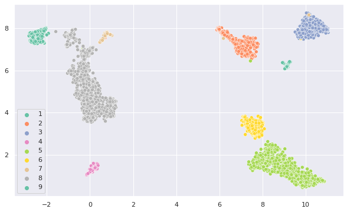

# text_clustering

Repositório destinado a armazenar scripts relativos a algoritmos de clusterização de textos, baseados em representações densas.

Utiliza-se a seguinte rotina para a realização de agrupamentos:

1. Dada uma coleção ".csv" de textos de entrada (**já processados conforme a necessidade da tarefa**), gera-se representações densas baseadas em *Transformers* ([sentence-transformers](https://www.sbert.net/docs/pretrained_models.html]))
2. Calibra-se os parâmetros do método de redução de dimensionalidade [UMAP](https://umap-learn.readthedocs.io/en/latest/) e do método de agrupamento [HDBSCAN](https://hdbscan.readthedocs.io/en/latest/how_hdbscan_works.html) visando maximizar a métrica DBCV, a qual é utilizada para avaliar a qualidade dos agrupamentos baseados em densidade de exemplos.
3. Utiliza-se os parâmetros obtidos para gerar *clusters* para posterior análise.

A Figura a seguir apresenta uma visualização 2D de um conjunto de *tweets* clusterizados seguindo a rotina descrita acima.

